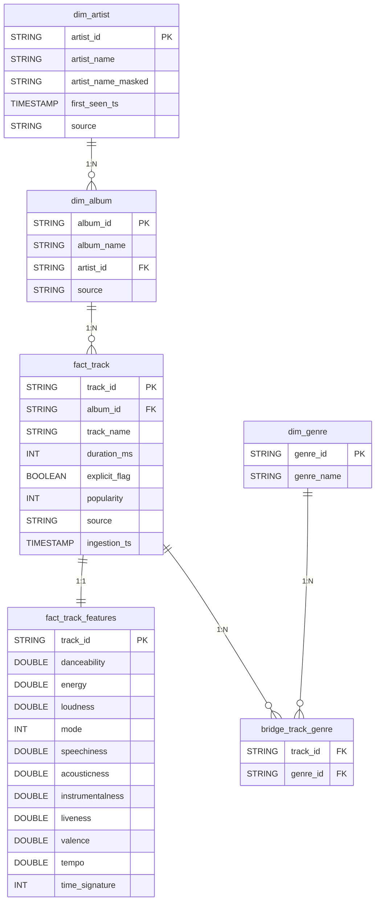

🧰 Instalação, Ambiente Virtual (venv) e Primeira Execução

Pré-requisitos
- Python 3.10+ (recomendado 3.11)
- Git instalado
- Conta no Kaggle (gratuita) para baixar os dados

Por que usar venv?
- O venv isola as dependências do projeto, garantindo reprodutibilidade (o avaliador terá as mesmas versões de bibliotecas) e evitando conflitos com outros projetos.

1) Clonar o repositório

git clone https://github.com/caiojanguas/data-master.git
cd data-master

2) Criar e ativar o ambiente virtual (venv)
2.1)- Windows – CMD (recomendado)

python -m venv .venv
.\.venv\Scripts\activate.bat

Caso não acione, rodar o script abaixo
python -m venv .venv
.\.venv\Scripts\activate.ps1

2.2)Windows – PowerShell
    Se o PowerShell bloquear scripts, você pode (A) usar o CMD acima, (B) usar o “modo sem ativar” abaixo, ou (C) habilitar scripts:

# (opcional) habilitar scripts na conta atual
Set-ExecutionPolicy -Scope CurrentUser -ExecutionPolicy RemoteSigned

# ativar
.\.venv\Scripts\Activate.ps1

2.3) Mac / Linux

python3 -m venv .venv
source .venv/bin/activate

2.4) Verificar se o venv está ativo

python -c "import sys; print(sys.executable)"

Saída esperada (caminho termina em …/.venv/Scripts/python.exe no Windows ou …/.venv/bin/python no Mac/Linux).

3) Instalar dependências

pip install -U pip
pip install -r requirements.txt

3.1) (Opcional) Registrar kernel Jupyter com este venv:

pip install ipykernel
python -m ipykernel install --user --name=case-venv

Depois, em notebooks, selecione o kernel case-venv.

4) Configurar credenciais do Kaggle (para baixar os dados)
Passo a passo

4.1)Entre no Kaggle → Account → Create New API Token.
Um arquivo kaggle.json será baixado.

4.2)Coloque o arquivo no local padrão do seu usuário:

- Windows
C:\Users\<SEU_USUARIO>\.kaggle\kaggle.json

- Mac/Linux
~/.kaggle/kaggle.json

🔒 Segurança

Nunca suba kaggle.json para o GitHub.
O arquivo .gitignore já impede isso.

5) Executar os primeiros passos do pipeline

5.1) Baixar e extrair o dataset do Kaggle

python -m src.extract_kaggle

Arquivos esperados em data/raw/kaggle/ (ex.: dataset.csv) e _INGESTION_METADATA.txt.

5.2) Construir a camada staging (DuckDB)

python -m src.build_staging

Saída esperada:
staging.kaggle_tracks criado com <N> linhas.

O banco será criado em data/staging/case.duckdb.

5.3) Checar rapidamente a tabela (opcional)

python -c "import duckdb; con=duckdb.connect('data/staging/case.duckdb'); \
print(con.execute('select count(*) from staging.kaggle_tracks').fetchone()[0])"

A resposta esperada deve conter o número de linhas da tabela

6) Estrutura de dados gerada (até esta etapa)

data/
├─ raw/
│  ├─ kaggle/
│  │  ├─ dataset.csv
│  │  └─ _INGESTION_METADATA.txt
├─ staging/
│  └─ case.duckdb     (schema staging com a tabela staging.kaggle_tracks)
├─ curated/           (será preenchida nas próximas etapas)
└─ outputs/           (será preenchida nas próximas etapas)

7) Solução de problemas (FAQ)

“ModuleNotFoundError: No module named 'duckdb'”
→ Você instalou as libs fora do venv. Ative o venv e rode pip install -r requirements.txt.
→ Ou use o atalho sem ativar:
.\.venv\Scripts\python.exe -m pip install -r requirements.txt

“Execução de scripts desabilitada (PowerShell)”

Use o CMD e ative com .\.venv\Scripts\activate.bat, ou

Habilite na conta atual:
Set-ExecutionPolicy -Scope CurrentUser -ExecutionPolicy RemoteSigned

“Kaggle 401/403”

Verifique se kaggle.json está no local correto (%USERPROFILE%\.kaggle\ no Windows; ~/.kaggle/ no Mac/Linux).

Alternativamente, exporte KAGGLE_USERNAME/KAGGLE_KEY na sessão do terminal.

8) Boas práticas adotadas

Ambiente virtual (venv) para isolamento e reprodutibilidade.

Dados não versionados no Git (apenas scripts). Tudo é gerado em tempo de execução.

DuckDB como engine SQL local (portável e rápido), com camadas raw → staging → curated.

Kaggle como fonte confiável; metadados de ingestão são registrados.

--------------
### 📐 Diagrama da Modelagem Curated

--------------------------------------------------

